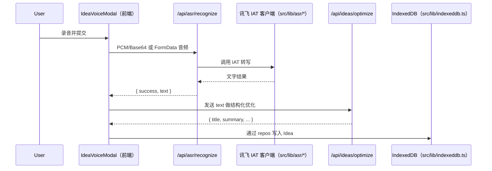
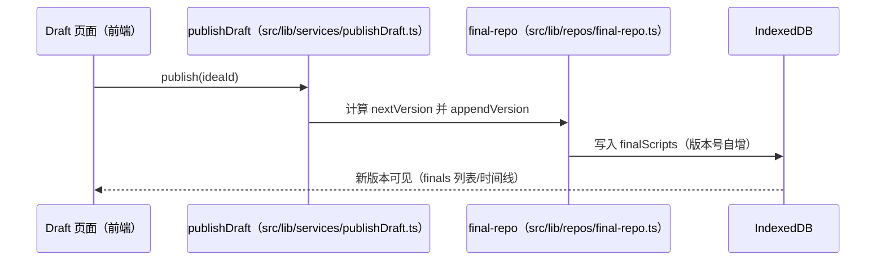
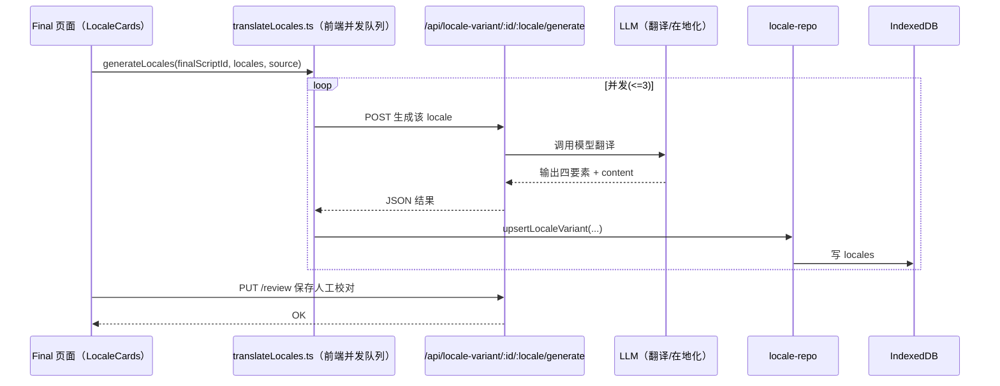
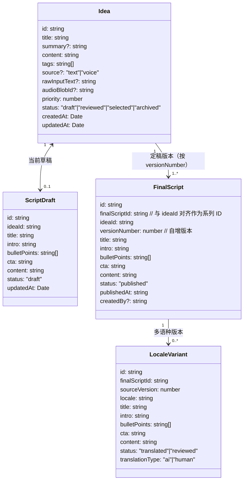

# 请你根据目前的项目架构，生成系统架构图，帮我理解目前的项目是如何运作的
_Exported on 2025/8/31 at GMT+8 16:02:04 from Cursor (1.5.9)_

---

**User**

请你根据目前的项目架构，生成系统架构图，帮我理解目前的项目是如何运作的 

---

**Cursor**

I'll scan the codebase to map the data flow, key modules, API routes, storage, and external integrations so I can produce accurate architecture diagrams. Then I'll generate concise Mermaid diagrams for system context, request flows, and data models.

我先梳理了前端页面、仓库层、API 路由、本地存储与外部服务的关系。下面用几张 Mermaid 图帮助你快速建立整体认知。

### 系统总览（运行时与边界）
```mermaid
flowchart TD
  U[用户浏览器 UI\nNext.js App Router + React\nsrc/app + src/components] -->|fetch| API[Next.js API Routes\nsrc/app/api/*]
  U -->|读写| IDB[IndexedDB 本地库\nsrc/lib/indexeddb.ts\nstores: ideas, scripts, finalScripts, locales, ideaAssets]

  subgraph 服务端/边缘（Next.js Route Handlers）
    API --> ASR[语音转写 IAT\nsrc/lib/asr/*\n/api/asr/recognize]
    API --> LLM[LLM（OpenAI 兼容 / Spark X1）\nsrc/lib/ai/*, src/lib/llm/spark-x1.ts\n/api/ideas/optimize\n/api/locale-variant/*]
  end

  U --> Repos[仓库层 Repos\nsrc/lib/repos/*]
  Repos --> IDB
```

### 关键请求流
- 语音收集 → 创意优化 → 入库


- 草稿发布 → 定稿版本化


- 多语种生成/重试/校对 → 入库


### 数据模型（核心实体与关系）


### 你可以从哪里查看对应代码
- 页面与导航：`src/app/(nav)/*`、`src/app/ideas/page.tsx`、`src/app/timeline/page.tsx`
- 仓库层：`src/lib/repos/idea-repo.ts`、`draft-repo.ts`、`final-repo.ts`、`locale-repo.ts`
- 本地存储封装：`src/lib/indexeddb.ts`
- AI/ASR 集成：
  - 语音转写：`src/app/api/asr/recognize/route.ts` → `src/lib/asr/*`
  - 创意优化：`src/app/api/ideas/optimize/route.ts` → `src/lib/ai/*`
  - 多语种生成/校对：`src/app/api/locale-variant/[finalScriptId]/[locale]/*`

- 业务服务：`src/lib/services/publishDraft.ts`、`rollbackToVersion.ts`、`translateLocales.ts`

- UI 关键组件：`src/components/ideas/IdeaVoiceModal.tsx`、`DraftEditor.tsx`、`FinalTimeline.tsx`、`LocaleCards.tsx`

- 类型定义：`src/types/domain.ts`

- 测试与脚本：`src/lib/asr/tests/*`、`src/lib/ai/tests/*`、`scripts/*`

- **核心运作要点**
  - 前端通过 `repos` 统一读写浏览器 `IndexedDB`。
  - API Routes 只做“能力服务”（ASR/LLM/翻译生成等），结果返回后由前端落地到 `IndexedDB`。
  - 草稿发布为“追加版本”，`finalScriptId = ideaId`，用 `versionNumber` 管理历史与回滚。
  - 多语种以 `(finalScriptId, sourceVersion, locale)` 组织，支持重试与人工校对。

- 需要我把图导出为图片或补充子域流程图（如 Draft 编辑热键/差异对比）吗？

- 对你最有用的改动/结论
  - 提供了总览、三条核心请求流和实体关系图，清晰展示了浏览器端 IndexedDB 为中心的本地优先架构，以及 API Routes 作为外部 AI/ASR 能力的网关。

```plaintext
flowchart TD
  U[用户浏览器 UI\nNext.js App Router + React\nsrc/app + src/components] -->|fetch| API[Next.js API Routes\nsrc/app/api/*]
  U -->|读写| IDB[IndexedDB 本地库\nsrc/lib/indexeddb.ts\nstores: ideas, scripts, finalScripts, locales, ideaAssets]

  subgraph 服务端/边缘（Next.js Route Handlers）
    API --> ASR[语音转写 IAT\nsrc/lib/asr/*\n/api/asr/recognize]
    API --> LLM[LLM（OpenAI 兼容 / Spark X1）\nsrc/lib/ai/*, src/lib/llm/spark-x1.ts\n/api/ideas/optimize\n/api/locale-variant/*]
  end

  U --> Repos[仓库层 Repos\nsrc/lib/repos/*]
  Repos --> IDB
```

```plaintext
sequenceDiagram
  participant User
  participant UI as IdeaVoiceModal（前端）
  participant ASR as /api/asr/recognize
  participant IAT as 讯飞 IAT 客户端（src/lib/asr/*）
  participant LLM as /api/ideas/optimize
  participant Store as IndexedDB（src/lib/indexeddb.ts）

  User->>UI: 录音并提交
  UI->>ASR: PCM/Base64 或 FormData 音频
  ASR->>IAT: 调用 IAT 转写
  IAT-->>ASR: 文字结果
  ASR-->>UI: { success, text }
  UI->>LLM: 发送 text 做结构化优化
  LLM-->>UI: { title, summary, ... }
  UI->>Store: 通过 repos 写入 Idea
```

```plaintext
sequenceDiagram
  participant UI as Draft 页面（前端）
  participant Svc as publishDraft（src/lib/services/publishDraft.ts）
  participant FinalRepo as final-repo（src/lib/repos/final-repo.ts）
  participant Store as IndexedDB

  UI->>Svc: publish(ideaId)
  Svc->>FinalRepo: 计算 nextVersion 并 appendVersion
  FinalRepo->>Store: 写入 finalScripts（版本号自增）
  Store-->>UI: 新版本可见（finals 列表/时间线）
```

```plaintext
sequenceDiagram
  participant UI as Final 页面（LocaleCards）
  participant Gen as translateLocales.ts（前端并发队列）
  participant API as /api/locale-variant/:id/:locale/generate
  participant LLM as LLM（翻译/在地化）
  participant Repo as locale-repo
  participant Store as IndexedDB

  UI->>Gen: generateLocales(finalScriptId, locales, source)
  loop 并发(<=3)
    Gen->>API: POST 生成该 locale
    API->>LLM: 调用模型翻译
    LLM-->>API: 输出四要素 + content
    API-->>Gen: JSON 结果
    Gen->>Repo: upsertLocaleVariant(...)
    Repo->>Store: 写 locales
  end
  UI->>API: PUT /review 保存人工校对
  API-->>UI: OK
```

```plaintext
classDiagram
  class Idea {
    id: string
    title: string
    summary?: string
    content: string
    tags: string[]
    source?: "text"|"voice"
    rawInputText?: string
    audioBlobId?: string
    priority: number
    status: "draft"|"reviewed"|"selected"|"archived"
    createdAt: Date
    updatedAt: Date
  }

  class ScriptDraft {
    id: string
    ideaId: string
    title: string
    intro: string
    bulletPoints: string[]
    cta: string
    content: string
    status: "draft"
    updatedAt: Date
  }

  class FinalScript {
    id: string
    finalScriptId: string  // 与 ideaId 对齐作为系列 ID
    ideaId: string
    versionNumber: number  // 自增版本
    title: string
    intro: string
    bulletPoints: string[]
    cta: string
    content: string
    status: "published"
    publishedAt: string
    createdBy?: string
  }

  class LocaleVariant {
    id: string
    finalScriptId: string
    sourceVersion: number
    locale: string
    title: string
    intro: string
    bulletPoints: string[]
    cta: string
    content: string
    status: "translated"|"reviewed"
    translationType: "ai"|"human"
  }

  Idea "1" <--> "0..1" ScriptDraft : 当前草稿
  Idea "1" --> "1..*" FinalScript : 定稿版本（按 versionNumber）
  FinalScript "1" --> "0..*" LocaleVariant : 多语种版本
```

