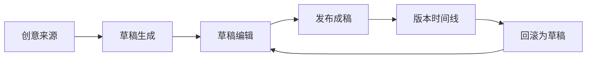

# 理解项目的业务流程
_Exported on 2025/8/26 at GMT+8 20:07:08 from Cursor (1.5.5)_

---

**User**

帮我理解项目的业务流程

---

**Cursor**

我先快速检索整体流程的关键环节（创意→优化→草稿生成→发布为成稿→时间线/回滚，以及本地存储与语音识别接入），然后打开相关核心文件确认实现细节。随后我会用简洁中文梳理业务流程图和主要数据结构。

我已定位到创意采集、ASR 转写、LLM 生成草稿、发布为成稿（版本化）、时间线与回滚、以及 IndexedDB 数据存储与仓库层的实现位置。下面用极简要点梳理业务流与涉及的代码。

### 端到端流程（从创意到发布与回滚）
- 创意采集
  - **手动**：`/ideas` 页面，存入 `ideas`。
  - **语音**：`IdeaVoiceModal.tsx` 录音 → 调用 `/api/asr/recognize` 转写 → 调 `/api/ideas/optimize` 优化 → 保存为 `Idea`。
- 草稿生成与编辑
  - 每个 `Idea` 仅有一个最新 `ScriptDraft`（唯一约束为 ideaId）。
  - 通过 `SuggestBox` 触发 LLM 生成接口 `/api/drafts/generate`（模式：normalize/enhance），返回四要素与 `content`，写入 `drafts`。
- 发布为成稿（版本化）
  - `publishDraft(ideaId)` 将当前草稿固化为 `FinalScript`，`finalScriptId = ideaId`，`versionNumber` 自增（只追加，不变更历史）。
  - UI 的 `/finals`、`/timeline` 展示历史版本。
- 回滚
  - 从某版本 `FinalScript` 恢复为当前草稿，以便再编辑并发布新版本。
- 存储
  - 统一用 `@/lib/indexeddb`（stores：`ideas`、`scripts`、`finalScripts`、`locales`、`ideaAssets`），仓库层在 `src/lib/repos/*`。

### 关键 API/服务与页面
- LLM 生成草稿：`POST /api/drafts/generate` → `@/lib/llm/spark-x1.ts` 前端封装调用。
- 语音识别：`POST /api/asr/recognize` → `@/lib/asr/iatClient` 调讯飞 IAT。
- 发布/回滚：`@/lib/services/publishDraft.ts`、`@/lib/services/rollbackToVersion.ts`。
- 页面导航：
  - 创意：`src/app/ideas/page.tsx`
  - 草稿：`src/app/(nav)/drafts/page.tsx` 与 `src/app/(nav)/drafts/[id]/page.tsx`
  - 成稿：`src/app/(nav)/finals/page.tsx` 与 `src/app/(nav)/finals/[finalScriptId]/page.tsx`
  - 时间线：`src/app/timeline/page.tsx`

### 数据模型要点
- `Idea`：原始输入（手动/语音→ASR→优化）。
- `ScriptDraft`：仅保存“当前草稿”；四要素与冗余 `content`。
- `FinalScript`：版本化记录，`finalScriptId = ideaId`，`versionNumber = 1..N`，只追加。

### 小片段（关键实现）
发布草稿为成稿（并发安全，指数退避）：
```1:45:src/lib/services/publishDraft.ts
import type { FinalScript, ScriptDraft } from '@/types/domain'
import * as DraftRepo from '@/lib/repos/draft-repo'
import * as FinalRepo from '@/lib/repos/final-repo'
import { AppError } from './errors'

const MAX_RETRY = 3

export async function publishDraft(ideaId: string, createdBy?: string): Promise<FinalScript> {
  const draft = await DraftRepo.findByIdeaId(ideaId)
  if (!draft) {
    throw new AppError('NOT_FOUND', '草稿不存在')
  }

  const finalScriptId = ideaId

  const content = buildContent(draft)

  let lastErr: unknown
  for (let attempt = 0; attempt < MAX_RETRY; attempt++) {
    try {
      const nextVersion = (await FinalRepo.getMaxVersion(finalScriptId)) + 1
      const record: Omit<FinalScript, 'id' | 'createdAt' | 'updatedAt' | 'versionNumber'> = {
        finalScriptId,
        ideaId,
        title: draft.title,
        intro: draft.intro,
        bulletPoints: draft.bulletPoints,
        cta: draft.cta,
        content,
        status: 'published',
        publishedAt: new Date().toISOString(),
        createdBy,
      }
      return await FinalRepo.appendVersion(record, nextVersion)
    } catch (err) {
      lastErr = err
      await delay(50 * Math.pow(2, attempt))
    }
  }
  throw new AppError('CONCURRENCY_RETRY_EXCEEDED', '发布失败：并发冲突重试超限', lastErr)
}
```

LLM 生成草稿（严格 JSON，失败自纠一次）：
```78:107:src/app/api/drafts/generate/route.ts
export async function POST(req: NextRequest) {
  try {
    const body = (await req.json()) as Body
    if (!body?.idea?.title || !body?.draft) {
      return NextResponse.json({ code: 'VALIDATION_ERROR', message: '参数缺失' }, { status: 400 })
    }

    const first = await callModel(body)
    let result = parseStrict(first)

    if (!result) {
      const userRepair = buildUserPrompt(body) + '\n\n严格要求：仅输出合法 JSON，不要额外解释。'
      const system = buildSystemPrompt(body.mode)
      const retry = await simpleChat(userRepair, system, { temperature: 0.2, maxTokens: 800, timeout: 30000 })
      result = parseStrict(retry.text || '')
    }

    if (!result) {
      return NextResponse.json({ code: 'PARSE_ERROR', message: '结果格式错误' }, { status: 500 })
    }

    return NextResponse.json(result)
  } catch (e) {
    const msg = e instanceof Error ? e.message : '未知错误'
    const code = msg.includes('timeout') ? 'TIMEOUT' : 'INTERNAL_ERROR'
    return NextResponse.json({ code, message: msg }, { status: 500 })
  }
}
```

语音识别 API（支持 JSON/FormData）：
```102:140:src/app/api/asr/recognize/route.ts
export async function POST(request: NextRequest): Promise<NextResponse<RecognizeResponse>> {
  const startTime = Date.now();
  try {
    let audioBase64: string;
    let audioParams: any = {};
    let languageParams: any = {};
    let addPunctuation = true;

    const contentType = request.headers.get('content-type') || '';
    if (contentType.includes('multipart/form-data')) {
      const formData = await request.formData();
      const audioFile = formData.get('file') as File;
      if (!audioFile) {
        return NextResponse.json({ success: false, error: '未找到音频文件，请确保文件字段名为 "file"', errorCode: 'MISSING_FILE' }, { status: 400 });
      }
      if (audioFile.size > 10 * 1024 * 1024) {
        return NextResponse.json({ success: false, error: '音频文件过大，请确保文件小于 10MB', errorCode: 'FILE_TOO_LARGE' }, { status: 400 });
      }
      if (!audioFile.type.startsWith('audio/')) {
        return NextResponse.json({ success: false, error: '不支持的文件类型，请上传音频文件', errorCode: 'INVALID_FILE_TYPE' }, { status: 400 });
      }
      const arrayBuffer = await audioFile.arrayBuffer();
      const buffer = Buffer.from(arrayBuffer);
      audioBase64 = buffer.toString('base64');
      // ... 读取可选参数
```

### 你可以从哪里开始体验
- 运行后打开 `/ideas`：创建或语音录入一个创意。
- 在草稿页使用建议框生成四要素内容并保存草稿。
- 点击发布，前往 `/finals` 或 `/timeline` 查看版本；尝试回滚再发布新版本。

- 草稿/成稿演示脚本：`scripts/demo.ts`

- - 我梳理了创意→草稿→发布→时间线/回滚全流程，以及对应的 API、服务、页面与数据模型。
- 贴出发布、生成与 ASR 的关键实现片段，便于你快速定位与扩展。

```typescript
import type { FinalScript, ScriptDraft } from '@/types/domain'
import * as DraftRepo from '@/lib/repos/draft-repo'
import * as FinalRepo from '@/lib/repos/final-repo'
import { AppError } from './errors'

const MAX_RETRY = 3

export async function publishDraft(ideaId: string, createdBy?: string): Promise<FinalScript> {
  const draft = await DraftRepo.findByIdeaId(ideaId)
  if (!draft) {
    throw new AppError('NOT_FOUND', '草稿不存在')
  }

  const finalScriptId = ideaId

  const content = buildContent(draft)

  let lastErr: unknown
  for (let attempt = 0; attempt < MAX_RETRY; attempt++) {
    try {
      const nextVersion = (await FinalRepo.getMaxVersion(finalScriptId)) + 1
      const record: Omit<FinalScript, 'id' | 'createdAt' | 'updatedAt' | 'versionNumber'> = {
        finalScriptId,
        ideaId,
        title: draft.title,
        intro: draft.intro,
        bulletPoints: draft.bulletPoints,
        cta: draft.cta,
        content,
        status: 'published',
        publishedAt: new Date().toISOString(),
        createdBy,
      }
      return await FinalRepo.appendVersion(record, nextVersion)
    } catch (err) {
      lastErr = err
      await delay(50 * Math.pow(2, attempt))
    }
  }
  throw new AppError('CONCURRENCY_RETRY_EXCEEDED', '发布失败：并发冲突重试超限', lastErr)
}
```

```typescript
export async function POST(req: NextRequest) {
  try {
    const body = (await req.json()) as Body
    if (!body?.idea?.title || !body?.draft) {
      return NextResponse.json({ code: 'VALIDATION_ERROR', message: '参数缺失' }, { status: 400 })
    }

    const first = await callModel(body)
    let result = parseStrict(first)

    if (!result) {
      const userRepair = buildUserPrompt(body) + '\n\n严格要求：仅输出合法 JSON，不要额外解释。'
      const system = buildSystemPrompt(body.mode)
      const retry = await simpleChat(userRepair, system, { temperature: 0.2, maxTokens: 800, timeout: 30000 })
      result = parseStrict(retry.text || '')
    }

    if (!result) {
      return NextResponse.json({ code: 'PARSE_ERROR', message: '结果格式错误' }, { status: 500 })
    }

    return NextResponse.json(result)
  } catch (e) {
    const msg = e instanceof Error ? e.message : '未知错误'
    const code = msg.includes('timeout') ? 'TIMEOUT' : 'INTERNAL_ERROR'
    return NextResponse.json({ code, message: msg }, { status: 500 })
  }
}
```

```typescript
export async function POST(request: NextRequest): Promise<NextResponse<RecognizeResponse>> {
  const startTime = Date.now();
  try {
    let audioBase64: string;
    let audioParams: any = {};
    let languageParams: any = {};
    let addPunctuation = true;

    const contentType = request.headers.get('content-type') || '';
    if (contentType.includes('multipart/form-data')) {
      const formData = await request.formData();
      const audioFile = formData.get('file') as File;
      if (!audioFile) {
        return NextResponse.json({ success: false, error: '未找到音频文件，请确保文件字段名为 "file"', errorCode: 'MISSING_FILE' }, { status: 400 });
      }
      if (audioFile.size > 10 * 1024 * 1024) {
        return NextResponse.json({ success: false, error: '音频文件过大，请确保文件小于 10MB', errorCode: 'FILE_TOO_LARGE' }, { status: 400 });
      }
      if (!audioFile.type.startsWith('audio/')) {
        return NextResponse.json({ success: false, error: '不支持的文件类型，请上传音频文件', errorCode: 'INVALID_FILE_TYPE' }, { status: 400 });
      }
      const arrayBuffer = await audioFile.arrayBuffer();
      const buffer = Buffer.from(arrayBuffer);
      audioBase64 = buffer.toString('base64');
      // ... 读取可选参数
```

---

**User**

帮我绘制一个业务流程图

---

**Cursor**

### 业务流程图（高层）

```mermaid
graph TD
  %% 分区
  subgraph UI[前端 UI]
    Ideas[/Ideas 页面/]
    Voice[IdeaVoiceModal 语音录入]
    Draft[/Draft 编辑页/]
    Finals[/Finals 列表/]
    Timeline[/时间线/]
  end

  subgraph API[API 路由]
    ASR[/api/asr/recognize/]
    Optimize[/api/ideas/optimize/]
    GenDraft[/api/drafts/generate/]
  end

  subgraph Svc[业务服务 / 仓库层]
    Pub[publishDraft()]
    Roll[rollbackToVersion()]
    IdeaRepo[IdeaRepo]
    DraftRepo[DraftRepo]
    FinalRepo[FinalRepo]
  end

  subgraph DB[存储]
    IDB[(IndexedDB\nideas / scripts / finalScripts / locales / ideaAssets)]
  end

  %% 语音采集 → ASR → 优化 → 保存为创意
  Voice --> ASR
  ASR --> Optimize
  Optimize --> IdeaRepo
  IdeaRepo --> IDB
  IDB --> Ideas

  %% 手动创建或从创意进入草稿
  Ideas --> Draft
  Draft --> GenDraft
  GenDraft --> DraftRepo
  DraftRepo --> IDB
  IDB --> Draft

  %% 发布为成稿（版本化）
  Draft --> Pub
  Pub --> FinalRepo
  FinalRepo --> IDB
  IDB --> Finals
  IDB --> Timeline

  %% 回滚为草稿
  Timeline --> Roll
  Roll --> DraftRepo
  DraftRepo --> IDB
  IDB --> Draft
```

### 详细交互（语音采集路径）

```mermaid
sequenceDiagram
  participant U as 用户
  participant V as IdeaVoiceModal
  participant ASR as /api/asr/recognize
  participant IAT as iatClient.transcribe
  participant OPT as /api/ideas/optimize
  participant Repo as IdeaRepo + IndexedDB

  U->>V: 开始录音/结束录音
  V->>ASR: 提交 Base64 PCM(16k RAW)
  ASR->>IAT: transcribe(params)
  IAT-->>ASR: 文本结果
  ASR-->>V: 文本（含处理时长）
  V->>OPT: 提交文本进行 LLM 优化
  OPT-->>V: 标题/摘要
  V->>Repo: 保存 Idea
  Repo-->>V: OK（落地 IndexedDB）
```

- **说明**
  - 生成草稿：`/api/drafts/generate` 返回四要素+content，写入 `DraftRepo`。
  - 发布成稿：`publishDraft()` 基于草稿追加 `FinalScript` 版本（`finalScriptId = ideaId`，`versionNumber` 递增）。
  - 回滚：`rollbackToVersion()` 取某版本成稿还原为当前草稿。
  - 持久化：统一使用 `@/lib/indexeddb` 封装与各 `Repo` 访问。

- 我提供了两张 Mermaid 图：一张高层流程图、一张语音采集的时序图，覆盖创意→草稿→发布→时间线/回滚的主链路与存储落地。

```plaintext
graph TD
  %% 分区
  subgraph UI[前端 UI]
    Ideas[/Ideas 页面/]
    Voice[IdeaVoiceModal 语音录入]
    Draft[/Draft 编辑页/]
    Finals[/Finals 列表/]
    Timeline[/时间线/]
  end

  subgraph API[API 路由]
    ASR[/api/asr/recognize/]
    Optimize[/api/ideas/optimize/]
    GenDraft[/api/drafts/generate/]
  end

  subgraph Svc[业务服务 / 仓库层]
    Pub[publishDraft()]
    Roll[rollbackToVersion()]
    IdeaRepo[IdeaRepo]
    DraftRepo[DraftRepo]
    FinalRepo[FinalRepo]
  end

  subgraph DB[存储]
    IDB[(IndexedDB\nideas / scripts / finalScripts / locales / ideaAssets)]
  end

  %% 语音采集 → ASR → 优化 → 保存为创意
  Voice --> ASR
  ASR --> Optimize
  Optimize --> IdeaRepo
  IdeaRepo --> IDB
  IDB --> Ideas

  %% 手动创建或从创意进入草稿
  Ideas --> Draft
  Draft --> GenDraft
  GenDraft --> DraftRepo
  DraftRepo --> IDB
  IDB --> Draft

  %% 发布为成稿（版本化）
  Draft --> Pub
  Pub --> FinalRepo
  FinalRepo --> IDB
  IDB --> Finals
  IDB --> Timeline

  %% 回滚为草稿
  Timeline --> Roll
  Roll --> DraftRepo
  DraftRepo --> IDB
  IDB --> Draft
```

```plaintext
sequenceDiagram
  participant U as 用户
  participant V as IdeaVoiceModal
  participant ASR as /api/asr/recognize
  participant IAT as iatClient.transcribe
  participant OPT as /api/ideas/optimize
  participant Repo as IdeaRepo + IndexedDB

  U->>V: 开始录音/结束录音
  V->>ASR: 提交 Base64 PCM(16k RAW)
  ASR->>IAT: transcribe(params)
  IAT-->>ASR: 文本结果
  ASR-->>V: 文本（含处理时长）
  V->>OPT: 提交文本进行 LLM 优化
  OPT-->>V: 标题/摘要
  V->>Repo: 保存 Idea
  Repo-->>V: OK（落地 IndexedDB）
```

---

**User**

你的流程图语法报错了，请你重新绘制

---

**Cursor**

### 业务流程图（修正版）

```mermaid
flowchart TD
  subgraph UI[前端 UI]
    Ideas[Ideas 页面]
    Voice[IdeaVoiceModal 语音录入]
    Draft[Draft 编辑页]
    Finals[Finals 列表]
    Timeline[时间线]
  end

  subgraph API[API 路由]
    ASR[/api/asr/recognize]
    Optimize[/api/ideas/optimize]
    GenDraft[/api/drafts/generate]
  end

  subgraph Svc[业务服务与仓库]
    Pub[publishDraft()]
    Roll[rollbackToVersion()]
    IdeaRepo[IdeaRepo]
    DraftRepo[DraftRepo]
    FinalRepo[FinalRepo]
  end

  subgraph DB[IndexedDB]
    IDB[(ideas, scripts, finalScripts, locales, ideaAssets)]
  end

  Voice --> ASR --> Optimize --> IdeaRepo --> IDB --> Ideas
  Ideas --> Draft
  Draft --> GenDraft --> DraftRepo --> IDB --> Draft
  Draft --> Pub --> FinalRepo --> IDB --> Finals
  IDB --> Timeline
  Timeline --> Roll --> DraftRepo --> IDB --> Draft
```

### 时序图（语音采集到创意）

```mermaid
sequenceDiagram
  participant U as 用户
  participant V as IdeaVoiceModal
  participant ASR as /api/asr/recognize
  participant IAT as iatClient.transcribe
  participant OPT as /api/ideas/optimize
  participant Repo as IdeaRepo + IndexedDB

  U->>V: 开始/结束录音
  V->>ASR: Base64 PCM(16k RAW)
  ASR->>IAT: transcribe(params)
  IAT-->>ASR: 文本
  ASR-->>V: 文本与耗时
  V->>OPT: 文本进行 LLM 优化
  OPT-->>V: 标题/摘要
  V->>Repo: 保存 Idea
  Repo-->>V: OK
```

- 已修正 Mermaid 语法与节点形状，确保可直接渲染。

```plaintext
flowchart TD
  subgraph UI[前端 UI]
    Ideas[Ideas 页面]
    Voice[IdeaVoiceModal 语音录入]
    Draft[Draft 编辑页]
    Finals[Finals 列表]
    Timeline[时间线]
  end

  subgraph API[API 路由]
    ASR[/api/asr/recognize]
    Optimize[/api/ideas/optimize]
    GenDraft[/api/drafts/generate]
  end

  subgraph Svc[业务服务与仓库]
    Pub[publishDraft()]
    Roll[rollbackToVersion()]
    IdeaRepo[IdeaRepo]
    DraftRepo[DraftRepo]
    FinalRepo[FinalRepo]
  end

  subgraph DB[IndexedDB]
    IDB[(ideas, scripts, finalScripts, locales, ideaAssets)]
  end

  Voice --> ASR --> Optimize --> IdeaRepo --> IDB --> Ideas
  Ideas --> Draft
  Draft --> GenDraft --> DraftRepo --> IDB --> Draft
  Draft --> Pub --> FinalRepo --> IDB --> Finals
  IDB --> Timeline
  Timeline --> Roll --> DraftRepo --> IDB --> Draft
```

```plaintext
sequenceDiagram
  participant U as 用户
  participant V as IdeaVoiceModal
  participant ASR as /api/asr/recognize
  participant IAT as iatClient.transcribe
  participant OPT as /api/ideas/optimize
  participant Repo as IdeaRepo + IndexedDB

  U->>V: 开始/结束录音
  V->>ASR: Base64 PCM(16k RAW)
  ASR->>IAT: transcribe(params)
  IAT-->>ASR: 文本
  ASR-->>V: 文本与耗时
  V->>OPT: 文本进行 LLM 优化
  OPT-->>V: 标题/摘要
  V->>Repo: 保存 Idea
  Repo-->>V: OK
```

---

**User**

仍然提示 Mermaid Syntax Error ，你可以简化流程图，来降低报错的风险

---

**Cursor**

### 简化业务流程图

```mermaid
flowchart LR
  I[创意(手动/语音)]
  G[生成草稿]
  E[编辑草稿]
  P[发布]
  F[成稿(版本化)]
  T[时间线]
  R[回滚]

  I --> G --> E --> P --> F --> T --> R --> E
```

- 覆盖创意 → 生成草稿 → 编辑 → 发布成稿(版本化) → 时间线查看 → 回滚到草稿的最小闭环流程。

```plaintext
flowchart LR
  I[创意(手动/语音)]
  G[生成草稿]
  E[编辑草稿]
  P[发布]
  F[成稿(版本化)]
  T[时间线]
  R[回滚]

  I --> G --> E --> P --> F --> T --> R --> E
```

---

**User**

请你帮我绘制业务流程图 你是一个图表生成助手，请根据以下说明生成 Mermaid 流程图代码：

1. 图表类型：flowchart LR（从左到右）
2. 使用严格的 Mermaid 语法：
   - 节点用方括号或圆括号表示（例如 A[起点] 或 B((结束)）
   - 避免特殊字符（如引号、@、# 等），必要时用文本替换或去除
3. 输出格式要求：
   - 整段内容必须完整包含在三条反引号的代码块中：
     ```mermaid
     flowchart LR
     A[开始] --> B[下一步]
     B --> C[结束]
     ```
   - 禁止添加除代码以外的文字解释或注释
4. 若检测到语法错误，请修正后只输出有效图表代码
5. 最后附上一行链接，便于在 Mermaid Live Editor 查看：

---

**Cursor**



[在 Mermaid Live Editor 查看](https://mermaid.live)

```plaintext
flowchart LR
  A[创意来源] --> B[草稿生成]
  B --> C[草稿编辑]
  C --> D[发布成稿]
  D --> E[版本时间线]
  E --> F[回滚为草稿]
  F --> C[草稿编辑]
```

